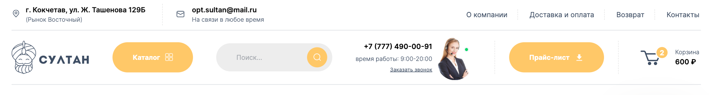
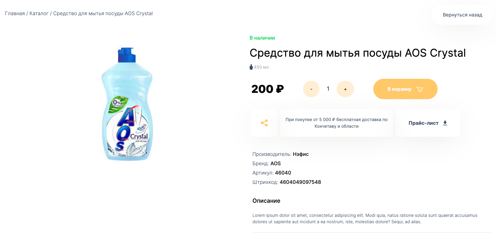
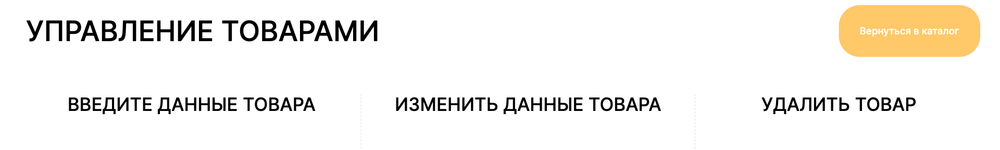

Online-Store Sultan
==========

------------
### Technologies:
* React
* Redux-Toolkit
* React-Router-Dom
* TypeScript
* SASS
* Flexbox
* Webpack
* JSON
* Jest and React testing library
* Deploy [GitPages](https://tsogoeva.github.io/sultan-online-store/)

____________

### Feature:

* 20 default goods from json
* Filtering and sorting the list of goods

____________

* Page for each product with detailed information

____________

* Shopping Cart

____________

* Version for mobile devices (320px)

____________

* Admin panel for goods management

____________

### Setup and Run:
* `npm ci`
* `npm run build`
* `npm run start`

*For test*: `npm run test`

__________

__________
